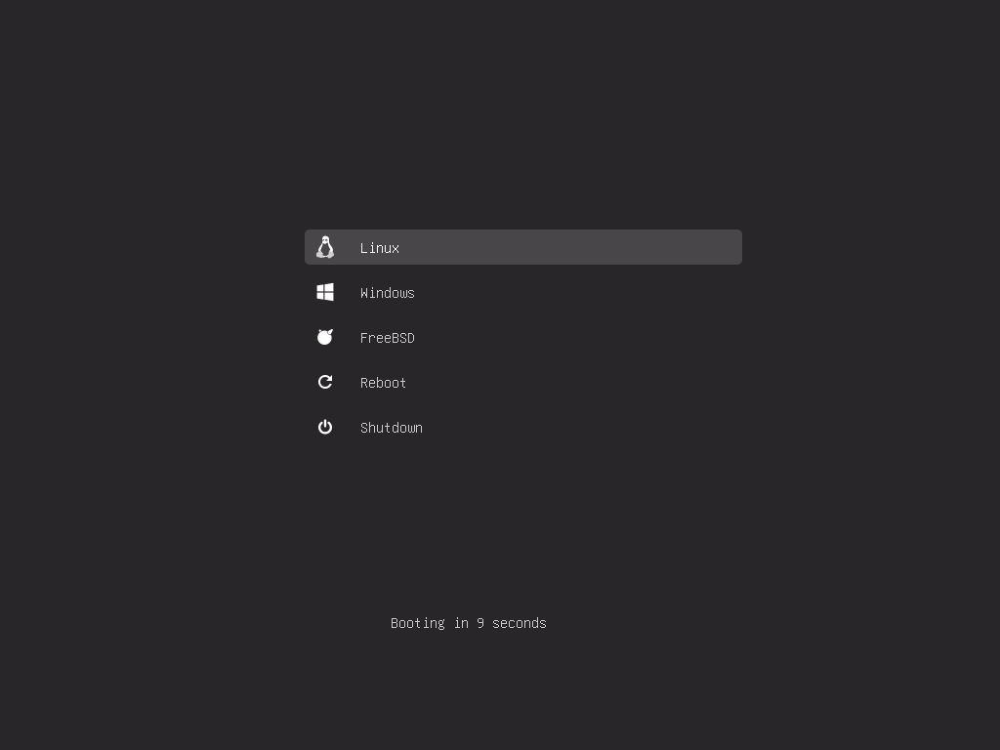

# GRUB for USB

Installing the GRUB loader on a USB device.

**The script creates only the primary boot partition of 1 GiB (EFI or Legacy). Use other utilities to mark up the rest of the unallocated space.**



## Usage

Clone the repository:

```bash
$ git clone https://github.com/AlexanderZhirov/gfu.git
```

Go to "GRUB for USB":

```bash
$ cd gfu
```

Install bootloader on your device (eg `/dev/sdd`):

```bash
$ sudo ./gfu.sh --device /dev/sdd --legacy
All data will be deleted from your device /dev/sdd. Are you ready to continue? [Y/N]: y
The msdos partition table on /dev/sdd has been created successfully.
i386-pc bootloader was installed successfully.
The boot device was created successfully!
```

### Help

```
Usage: gfu.sh -d <device> [OPTION]

        -d, --device <device>   Bootloader Installation Device
        -l, --legacy            Installing Legacy Bootloader
        -e, --efi               Installing EFI Bootloader
```

## Menuentries

The `grub/menuentries` directory contains configuration files that are automatically read by `grub.cfg`. Therefore, there is no need to edit the main file. It is enough to place your boot configurations in `grub/menuentries`.

## Themes

You can also upload the theme you want to the theme directory and set it as the default theme in `themes/theme.cfg`
